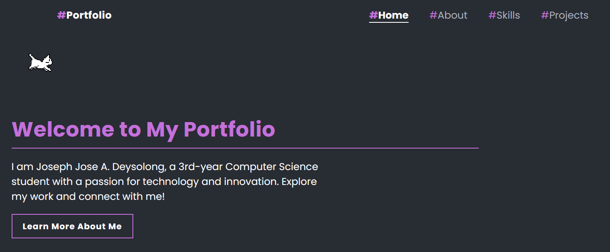

# ePortfolio  

  

Visit site here: 

https://astirisaqw.github.io/ePortfolio

Welcome to my ePortfolio! My name is Joseph Jose A. Deysolong, and I am a 3rd-year Computer Science student with a passion for technology and innovation. This portfolio showcases my projects, skills, and background. You can explore my journey, check out my works, and connect with me through various platforms.

## Technologies Used  
- **Frontend**:  
    - HTML
    - CSS
    - JavaScript
    - Bootstrap

## Installation  
To set up the project locally, run the following commands in your terminal:  
```bash  
git https://github.com/AstirisAQW/ePortfolio.git
cd ePortfolio
